# System Architecture Analysis

## Overview

- **Project**: /home/tom/github/wronai/goal
- **Analysis Mode**: static
- **Total Functions**: 270
- **Total Classes**: 17
- **Modules**: 32
- **Entry Points**: 176

## Architecture by Module

### goal.config
- **Functions**: 25
- **Classes**: 1
- **File**: `config.py`

### goal.smart_commit
- **Functions**: 20
- **Classes**: 2
- **File**: `smart_commit.py`

### goal.git_ops
- **Functions**: 20
- **File**: `git_ops.py`

### goal.generator.generator
- **Functions**: 17
- **Classes**: 1
- **File**: `generator.py`

### goal.project_doctor
- **Functions**: 17
- **Classes**: 2
- **File**: `project_doctor.py`

### goal.deep_analyzer
- **Functions**: 15
- **Classes**: 1
- **File**: `deep_analyzer.py`

### goal.cli.push_cmd
- **Functions**: 14
- **File**: `push_cmd.py`

### goal.summary.quality_filter
- **Functions**: 14
- **Classes**: 1
- **File**: `quality_filter.py`

### goal.user_config
- **Functions**: 12
- **Classes**: 1
- **File**: `user_config.py`

### goal.summary.generator
- **Functions**: 12
- **Classes**: 1
- **File**: `generator.py`

### goal.package_managers
- **Functions**: 12
- **Classes**: 1
- **File**: `package_managers.py`

### goal.cli
- **Functions**: 11
- **Classes**: 1
- **File**: `__init__.py`

### goal.formatter
- **Functions**: 11
- **Classes**: 1
- **File**: `formatter.py`

### goal.version_validation
- **Functions**: 10
- **File**: `version_validation.py`

### goal.cli.version
- **Functions**: 10
- **File**: `version.py`

### goal.project_bootstrap
- **Functions**: 9
- **File**: `project_bootstrap.py`

### goal.cli.utils_cmd
- **Functions**: 8
- **File**: `utils_cmd.py`

### goal.generator.git_ops
- **Functions**: 7
- **Classes**: 1
- **File**: `git_ops.py`

### goal.cli.config_cmd
- **Functions**: 7
- **File**: `config_cmd.py`

### goal.generator.analyzer
- **Functions**: 5
- **Classes**: 2
- **File**: `analyzer.py`

## Key Entry Points

Main execution flows into the system:

### goal.summary.validator.QualityValidator.validate
> Validate summary against all quality gates.

Returns: {valid: bool, errors: [], warnings: [], score: int, fixes: []}
- **Calls**: summary.get, summary.get, None.get, summary.get, summary.get, metrics.get, metrics.get, self.filter.has_banned_words

### goal.cli.push_cmd.push
> Add, commit, tag, and push changes to remote.
- **Calls**: main.command, click.option, click.option, click.option, click.option, click.option, click.option, click.option

### goal.generator.generator.CommitMessageGenerator.generate_detailed_message
> Generate a detailed commit message with body.
- **Calls**: self.generate_commit_message, self.get_changed_files, self.get_diff_stats, self.get_diff_content, self.get_name_status, self.get_numstat_map, goal.user_config.UserConfig.set, modified_files.extend

### goal.summary.generator.EnhancedSummaryGenerator._format_enhanced_body
> Format the enhanced commit body.

Produces a YAML structure optimised for git log / GitHub readers:
- changes:      per-file concrete additions/modifi
- **Calls**: self.quality_filter.categorize_files, relations.get, None.join, fa.get, fa.get, fa.get, fa.get, categorized.items

### goal.project_doctor._diagnose_python
> Run all Python-specific diagnostics.
- **Calls**: pyproject.read_text, LICENSE_CLASSIFIERS_RE.findall, re.search, re.search, re.search, re.search, requirements.exists, pyproject.exists

### goal.summary.validator.QualityValidator.auto_fix
> Auto-fix summary issues and return corrected summary.
- **Calls**: summary.copy, self.filter.categorize_files, fixed.get, self.filter.has_banned_words, fixed.get, re.match, fixed.get, len

### goal.cli.commit_cmd.validate
> Validate commit summary against quality gates.
- **Calls**: main.command, click.option, click.option, goal.git_ops.get_staged_files, goal.git_ops.get_diff_stats, ctx.obj.get, CommitMessageGenerator, generator.generate_detailed_message

### goal.generator.analyzer.ChangeAnalyzer.classify_change_type
> Classify the type of change using pattern matching and heuristics.
- **Calls**: defaultdict, any, all, all, diff_content.lower, self.TYPE_PATTERNS.items, any, any

### goal.smart_commit.SmartCommitGenerator.generate_message
> Generate commit message based on analysis.
- **Calls**: analysis.get, analysis.get, analysis.get, analysis.get, analysis.get, analysis.get, analysis.get, analysis.get

### goal.generator.analyzer.ContentAnalyzer.per_file_notes
> Generate small descriptive notes for a file based on added lines heuristics.
- **Calls**: cmd.extend, path.endswith, path.endswith, path.endswith, cmd.append, None.strip, re.findall, re.findall

### goal.cli.commit_cmd.fix_summary
> Auto-fix commit summary quality issues.
- **Calls**: main.command, click.option, click.option, click.option, goal.git_ops.get_staged_files, goal.git_ops.get_diff_stats, ctx.obj.get, CommitMessageGenerator

### goal.deep_analyzer.CodeChangeAnalyzer._analyze_python_diff
> Analyze Python code changes using AST.
- **Calls**: self._extract_python_entities, self._extract_python_entities, goal.user_config.UserConfig.set, goal.user_config.UserConfig.set, sum, sum, old_entities.keys, new_entities.keys

### goal.summary.generator.EnhancedSummaryGenerator.generate_enhanced_summary
> Generate complete enhanced summary with business value focus.
- **Calls**: self.quality_filter.dedupe_files, self.analyzer.generate_functional_summary, self.detect_capabilities, self.quality_filter.prioritize_capabilities, self.detect_file_relations, self.quality_filter.dedupe_relations, self.quality_filter.filter_generic_nodes, self._build_relation_chain

### goal.cli.doctor_cmd.doctor
> Diagnose and auto-fix common project configuration issues.
- **Calls**: main.command, click.option, click.option, click.option, None.resolve, goal.project_bootstrap.detect_project_types_deep, todo_file.exists, todo_file.write_text

### goal.deep_analyzer.CodeChangeAnalyzer.infer_functional_value
> Infer the functional value/impact of the changes.
- **Calls**: aggregated.get, aggregated.get, aggregated.get, aggregated.get, aggregated.get, any, any, any

### goal.smart_commit.SmartCommitGenerator.analyze_changes
> Analyze staged changes and extract abstractions.
- **Calls**: Counter, goal.user_config.UserConfig.set, self.abstraction.detect_features, self._infer_commit_type, self._generate_functional_summary, self._get_staged_files, len, defaultdict

### goal.smart_commit.SmartCommitGenerator._generate_functional_summary
> Generate a human-readable functional summary of changes.
- **Calls**: analysis.get, analysis.get, analysis.get, analysis.get, analysis.get, None.join, parts.append, parts.append

### goal.cli.commit_cmd.commit
> Generate a smart commit message for current changes.
- **Calls**: main.command, click.option, click.option, click.option, click.option, click.option, goal.git_ops.get_staged_files, ctx.obj.get

### goal.smart_commit.SmartCommitGenerator.generate_functional_body
> Generate a functional, human-readable commit body.
- **Calls**: analysis.get, analysis.get, analysis.get, analysis.get, analysis.get, analysis.get, analysis.get, parts.append

### goal.generator.analyzer.ContentAnalyzer.short_action_summary
> Return a short 2–6 word action summary (no LLM).
- **Calls**: diff_content.lower, any, f.lower, any, any, any, any, any

### goal.summary.generator.EnhancedSummaryGenerator.calculate_quality_metrics
> Calculate quality metrics for the changes.
- **Calls**: analysis.get, len, analysis.get, aggregated.get, min, min, min, min

### goal.smart_commit.CodeAbstraction.extract_entities
> Extract code entities (functions, classes, etc.) from diff.
- **Calls**: self.get_language, self.code_parsers.get, parser.get, parser.get, parser.get, goal.user_config.UserConfig.set, None.strip, any

### goal.project_doctor._diagnose_nodejs
- **Calls**: json.dumps, data.get, json.dumps, pkg_json.exists, json.loads, data.get, issues.append, data.get

### goal.cli.utils_cmd.status
> Show current git status and version info.
- **Calls**: main.command, click.option, goal.cli.version.get_current_version, goal.git_ops.get_remote_branch, goal.git_ops.get_staged_files, goal.git_ops.get_unstaged_files, ctx.obj.get, goal.formatter.format_status_output

### goal.config.GoalConfig._detect_version_files
> Detect version files in the project.
- **Calls**: None.exists, None.exists, None.exists, None.exists, None.exists, None.rglob, version_files.append, version_files.append

### goal.summary.generator.EnhancedSummaryGenerator.validate_summary_quality
> Validate summary against quality thresholds.
- **Calls**: None.get, config.get, config.get, config.get, None.split, sum, sum, warnings.append

### goal.config.GoalConfig._detect_project_name
> Detect project name from various sources.
- **Calls**: None.exists, None.exists, None.exists, Path.cwd, Path, None.read_text, re.search, Path

### goal.deep_analyzer.CodeChangeAnalyzer._build_summary
> Build human-readable summary.
- **Calls**: aggregated.get, aggregated.get, aggregated.get, aggregated.get, parts.append, parts.append, parts.append, parts.append

### goal.summary.validator.QualityValidator.__init__
- **Calls**: SummaryQualityFilter, self.config.get, quality.get, quality.get, commit_summary.get, commit_summary.get, commit_summary.get, commit_summary.get

### goal.summary.quality_filter.SummaryQualityFilter.classify_intent_smart
> Smart intent classification using multiple signals.
- **Calls**: sum, sum, sum, all, all, max, None.join, max

## Process Flows

Key execution flows identified:

### Flow 1: validate
```
validate [goal.summary.validator.QualityValidator]
```

### Flow 2: push
```
push [goal.cli.push_cmd]
```

### Flow 3: generate_detailed_message
```
generate_detailed_message [goal.generator.generator.CommitMessageGenerator]
```

### Flow 4: _format_enhanced_body
```
_format_enhanced_body [goal.summary.generator.EnhancedSummaryGenerator]
```

### Flow 5: _diagnose_python
```
_diagnose_python [goal.project_doctor]
```

### Flow 6: auto_fix
```
auto_fix [goal.summary.validator.QualityValidator]
```

### Flow 7: classify_change_type
```
classify_change_type [goal.generator.analyzer.ChangeAnalyzer]
```

### Flow 8: generate_message
```
generate_message [goal.smart_commit.SmartCommitGenerator]
```

### Flow 9: per_file_notes
```
per_file_notes [goal.generator.analyzer.ContentAnalyzer]
```

### Flow 10: fix_summary
```
fix_summary [goal.cli.commit_cmd]
  └─ →> get_staged_files
      └─> run_git
```

## Key Classes

### goal.config.GoalConfig
> Manages goal.yaml configuration file.
- **Methods**: 22
- **Key Methods**: goal.config.GoalConfig.__init__, goal.config.GoalConfig._find_config, goal.config.GoalConfig._find_git_root, goal.config.GoalConfig.exists, goal.config.GoalConfig.load, goal.config.GoalConfig._get_default_config, goal.config.GoalConfig._deep_copy, goal.config.GoalConfig._merge_configs, goal.config.GoalConfig._detect_project_name, goal.config.GoalConfig._detect_project_types

### goal.generator.generator.CommitMessageGenerator
> Generate conventional commit messages using diff analysis and lightweight classification.
- **Methods**: 16
- **Key Methods**: goal.generator.generator.CommitMessageGenerator.__init__, goal.generator.generator.CommitMessageGenerator.get_diff_stats, goal.generator.generator.CommitMessageGenerator.get_name_status, goal.generator.generator.CommitMessageGenerator.get_numstat_map, goal.generator.generator.CommitMessageGenerator.get_changed_files, goal.generator.generator.CommitMessageGenerator.get_diff_content, goal.generator.generator.CommitMessageGenerator.classify_change_type, goal.generator.generator.CommitMessageGenerator.detect_scope, goal.generator.generator.CommitMessageGenerator.extract_functions_changed, goal.generator.generator.CommitMessageGenerator._short_action_summary

### goal.deep_analyzer.CodeChangeAnalyzer
> Analyzes code changes to extract functional meaning.
- **Methods**: 15
- **Key Methods**: goal.deep_analyzer.CodeChangeAnalyzer.__init__, goal.deep_analyzer.CodeChangeAnalyzer.analyze_file_diff, goal.deep_analyzer.CodeChangeAnalyzer._detect_language, goal.deep_analyzer.CodeChangeAnalyzer._analyze_python_diff, goal.deep_analyzer.CodeChangeAnalyzer._extract_python_entities, goal.deep_analyzer.CodeChangeAnalyzer._get_decorator_name, goal.deep_analyzer.CodeChangeAnalyzer._calculate_complexity, goal.deep_analyzer.CodeChangeAnalyzer._analyze_js_diff, goal.deep_analyzer.CodeChangeAnalyzer._analyze_generic_diff, goal.deep_analyzer.CodeChangeAnalyzer._detect_functional_areas

### goal.summary.quality_filter.SummaryQualityFilter
> Filter noise and improve summary quality.
- **Methods**: 14
- **Key Methods**: goal.summary.quality_filter.SummaryQualityFilter.__init__, goal.summary.quality_filter.SummaryQualityFilter.is_noise, goal.summary.quality_filter.SummaryQualityFilter.filter_entities, goal.summary.quality_filter.SummaryQualityFilter.has_banned_words, goal.summary.quality_filter.SummaryQualityFilter.classify_intent, goal.summary.quality_filter.SummaryQualityFilter.prioritize_capabilities, goal.summary.quality_filter.SummaryQualityFilter.format_complexity_delta, goal.summary.quality_filter.SummaryQualityFilter.dedupe_relations, goal.summary.quality_filter.SummaryQualityFilter.dedupe_files, goal.summary.quality_filter.SummaryQualityFilter.categorize_files

### goal.summary.generator.EnhancedSummaryGenerator
> Generate business-value focused commit summaries.
- **Methods**: 12
- **Key Methods**: goal.summary.generator.EnhancedSummaryGenerator.__init__, goal.summary.generator.EnhancedSummaryGenerator.map_entity_to_role, goal.summary.generator.EnhancedSummaryGenerator.detect_capabilities, goal.summary.generator.EnhancedSummaryGenerator.detect_file_relations, goal.summary.generator.EnhancedSummaryGenerator._infer_domain, goal.summary.generator.EnhancedSummaryGenerator._build_relation_chain, goal.summary.generator.EnhancedSummaryGenerator._render_relations_ascii, goal.summary.generator.EnhancedSummaryGenerator.calculate_quality_metrics, goal.summary.generator.EnhancedSummaryGenerator.generate_value_title, goal.summary.generator.EnhancedSummaryGenerator.generate_enhanced_summary

### goal.smart_commit.SmartCommitGenerator
> Generates smart commit messages using code abstraction.
- **Methods**: 11
- **Key Methods**: goal.smart_commit.SmartCommitGenerator.__init__, goal.smart_commit.SmartCommitGenerator.deep_analyzer, goal.smart_commit.SmartCommitGenerator.analyze_changes, goal.smart_commit.SmartCommitGenerator._generate_functional_summary, goal.smart_commit.SmartCommitGenerator._get_staged_files, goal.smart_commit.SmartCommitGenerator._get_file_diff, goal.smart_commit.SmartCommitGenerator._infer_commit_type, goal.smart_commit.SmartCommitGenerator.generate_message, goal.smart_commit.SmartCommitGenerator.generate_functional_body, goal.smart_commit.SmartCommitGenerator.generate_changelog_entry

### goal.smart_commit.CodeAbstraction
> Extracts meaningful abstractions from code changes.
- **Methods**: 9
- **Key Methods**: goal.smart_commit.CodeAbstraction.__init__, goal.smart_commit.CodeAbstraction.get_domain, goal.smart_commit.CodeAbstraction.get_language, goal.smart_commit.CodeAbstraction.extract_entities, goal.smart_commit.CodeAbstraction.extract_markdown_topics, goal.smart_commit.CodeAbstraction.infer_benefit, goal.smart_commit.CodeAbstraction.detect_features, goal.smart_commit.CodeAbstraction.determine_abstraction_level, goal.smart_commit.CodeAbstraction.get_action_verb

### goal.formatter.MarkdownFormatter
> Formats Goal output as structured markdown for LLM consumption.
- **Methods**: 8
- **Key Methods**: goal.formatter.MarkdownFormatter.__init__, goal.formatter.MarkdownFormatter.add_header, goal.formatter.MarkdownFormatter.add_metadata, goal.formatter.MarkdownFormatter.add_section, goal.formatter.MarkdownFormatter.add_list, goal.formatter.MarkdownFormatter.add_command_output, goal.formatter.MarkdownFormatter.add_summary, goal.formatter.MarkdownFormatter.render

### goal.generator.git_ops.GitDiffOperations
> Git diff operations with caching.
- **Methods**: 7
- **Key Methods**: goal.generator.git_ops.GitDiffOperations.__init__, goal.generator.git_ops.GitDiffOperations.get_diff_stats, goal.generator.git_ops.GitDiffOperations.get_name_status, goal.generator.git_ops.GitDiffOperations.get_numstat_map, goal.generator.git_ops.GitDiffOperations.get_changed_files, goal.generator.git_ops.GitDiffOperations.get_diff_content, goal.generator.git_ops.GitDiffOperations.clear_cache

### goal.user_config.UserConfig
> Manages user-specific configuration stored in ~/.goal
- **Methods**: 6
- **Key Methods**: goal.user_config.UserConfig.__init__, goal.user_config.UserConfig._load, goal.user_config.UserConfig._save, goal.user_config.UserConfig.get, goal.user_config.UserConfig.set, goal.user_config.UserConfig.is_initialized

### goal.project_doctor.DoctorReport
> Aggregated report from a doctor run.
- **Methods**: 4
- **Key Methods**: goal.project_doctor.DoctorReport.errors, goal.project_doctor.DoctorReport.warnings, goal.project_doctor.DoctorReport.fixed, goal.project_doctor.DoctorReport.has_problems

### goal.generator.analyzer.ChangeAnalyzer
> Analyze git changes to classify type, detect scope, and extract functions.
- **Methods**: 3
- **Key Methods**: goal.generator.analyzer.ChangeAnalyzer.classify_change_type, goal.generator.analyzer.ChangeAnalyzer.detect_scope, goal.generator.analyzer.ChangeAnalyzer.extract_functions_changed

### goal.summary.validator.QualityValidator
> Validate commit summary against quality gates.
- **Methods**: 3
- **Key Methods**: goal.summary.validator.QualityValidator.__init__, goal.summary.validator.QualityValidator.validate, goal.summary.validator.QualityValidator.auto_fix

### goal.generator.analyzer.ContentAnalyzer
> Analyze content for short summaries and per-file notes.
- **Methods**: 2
- **Key Methods**: goal.generator.analyzer.ContentAnalyzer.short_action_summary, goal.generator.analyzer.ContentAnalyzer.per_file_notes

### goal.cli.GoalGroup
> Custom Click Group that shows docs URL for unknown commands (like Poetry),
and defaults to 'push' co
- **Methods**: 2
- **Key Methods**: goal.cli.GoalGroup.get_command, goal.cli.GoalGroup.parse_args
- **Inherits**: click.Group

### goal.package_managers.PackageManager
> Package manager configuration and capabilities.
- **Methods**: 1
- **Key Methods**: goal.package_managers.PackageManager.__post_init__

### goal.project_doctor.Issue
> A single diagnosed issue.
- **Methods**: 0

## Data Transformation Functions

Key functions that process and transform data:

### goal.version_validation.validate_project_versions
> Validate versions across different registries.

Returns:
    Dict with validation results for each p
- **Output to**: Path, pyproject_path.exists, goal.version_validation.get_pypi_version, Path, package_json_path.exists

### goal.version_validation.format_validation_results
> Format validation results for display.
- **Output to**: results.items, messages.append, messages.append, messages.append, messages.append

### goal.config.GoalConfig.validate
> Validate the configuration.

Returns a list of validation errors (empty if valid).
- **Output to**: self.get, self.get, self.get, self.load, self.get

### goal.formatter.format_push_result
> Format push command result as markdown.
- **Output to**: MarkdownFormatter, formatter.add_metadata, formatter.add_header, sum, sum

### goal.formatter.format_enhanced_summary
> Format enhanced business-value summary as markdown.
- **Output to**: MarkdownFormatter, formatter.add_metadata, formatter.add_header, sum, sum

### goal.formatter.format_status_output
> Format status command output as markdown.
- **Output to**: MarkdownFormatter, formatter.add_header, None.strip, formatter.add_section, formatter.add_list

### goal.smart_commit.SmartCommitGenerator.format_changelog_entry
> Format changelog entry as markdown.
- **Output to**: entry.get, entry.get, entry.get, None.join

### goal.git_ops.validate_repo_url
> Validate that a URL looks like a git repository (HTTP/HTTPS/SSH).
- **Output to**: url.strip, re.match, re.match

### goal.cli.commit_cmd.validate
> Validate commit summary against quality gates.
- **Output to**: main.command, click.option, click.option, goal.git_ops.get_staged_files, goal.git_ops.get_diff_stats

### goal.cli.config_cmd.config_validate
> Validate goal.yaml configuration.
- **Output to**: config.command, ctx.obj.get, cfg.validate, goal.config.ensure_config, click.echo

### goal.summary.validator.QualityValidator.validate
> Validate summary against all quality gates.

Returns: {valid: bool, errors: [], warnings: [], score:
- **Output to**: summary.get, summary.get, None.get, summary.get, summary.get

### goal.summary.generator.EnhancedSummaryGenerator._format_enhanced_body
> Format the enhanced commit body.

Produces a YAML structure optimised for git log / GitHub readers:

- **Output to**: self.quality_filter.categorize_files, relations.get, None.join, fa.get, fa.get

### goal.summary.generator.EnhancedSummaryGenerator.validate_summary_quality
> Validate summary against quality thresholds.
- **Output to**: None.get, config.get, config.get, config.get, None.split

### goal.summary.validate_summary
> Validate summary against quality gates.

Returns: {valid: bool, errors: [], warnings: [], score: int
- **Output to**: QualityValidator, validator.validate, summary.get

### goal.summary.quality_filter.SummaryQualityFilter.format_complexity_delta
> Format complexity change as interpretable metric with sane caps.

Returns: (emoji, description)
- **Output to**: abs, abs

### goal.summary.quality_filter.SummaryQualityFilter.format_net_lines
> Format NET lines change with proper interpretation.

Returns: (emoji, description)

### goal.package_managers.format_package_manager_command
> Format a package manager command with the given parameters.

Args:
    pm: Package manager instance

- **Output to**: getattr, ValueError, command_template.format, ValueError

### goal.cli.GoalGroup.parse_args
- **Output to**: any, None.parse_args, super, a.startswith

### goal.project_doctor._format_todo_entry
> Format issue as TODO.md entry.
- **Output to**: goal.project_doctor._generate_ticket_id, None.get

## Public API Surface

Functions exposed as public API (no underscore prefix):

- `goal.summary.validator.QualityValidator.validate` - 89 calls
- `goal.git_ops.ensure_git_repository` - 83 calls
- `goal.cli.version.sync_all_versions` - 69 calls
- `goal.cli.push_cmd.push` - 69 calls
- `goal.generator.generator.CommitMessageGenerator.generate_detailed_message` - 68 calls
- `goal.summary.validator.QualityValidator.auto_fix` - 59 calls
- `goal.project_bootstrap.ensure_project_environment` - 56 calls
- `goal.user_config.initialize_user_config` - 52 calls
- `goal.cli.commit_cmd.validate` - 45 calls
- `goal.formatter.format_push_result` - 44 calls
- `goal.generator.analyzer.ChangeAnalyzer.classify_change_type` - 44 calls
- `goal.smart_commit.SmartCommitGenerator.generate_message` - 43 calls
- `goal.generator.analyzer.ContentAnalyzer.per_file_notes` - 43 calls
- `goal.formatter.format_enhanced_summary` - 39 calls
- `goal.cli.commit_cmd.fix_summary` - 38 calls
- `goal.summary.generator.EnhancedSummaryGenerator.generate_enhanced_summary` - 36 calls
- `goal.changelog.update_changelog` - 35 calls
- `goal.cli.doctor_cmd.doctor` - 34 calls
- `goal.deep_analyzer.CodeChangeAnalyzer.infer_functional_value` - 33 calls
- `goal.smart_commit.SmartCommitGenerator.analyze_changes` - 33 calls
- `goal.cli.commit_cmd.commit` - 33 calls
- `goal.cli.version.update_project_metadata` - 32 calls
- `goal.user_config.show_user_config` - 31 calls
- `goal.version_validation.validate_project_versions` - 28 calls
- `goal.project_bootstrap.guess_package_name` - 28 calls
- `goal.smart_commit.SmartCommitGenerator.generate_functional_body` - 27 calls
- `goal.generator.analyzer.ContentAnalyzer.short_action_summary` - 26 calls
- `goal.summary.generator.EnhancedSummaryGenerator.calculate_quality_metrics` - 26 calls
- `goal.user_config.prompt_for_license` - 25 calls
- `goal.smart_commit.CodeAbstraction.extract_entities` - 25 calls
- `goal.git_ops.ensure_remote` - 23 calls
- `goal.cli.utils_cmd.status` - 21 calls
- `goal.project_doctor.diagnose_and_report` - 21 calls
- `goal.cli.version.update_readme_metadata` - 19 calls
- `goal.summary.generator.EnhancedSummaryGenerator.validate_summary_quality` - 19 calls
- `goal.project_doctor.add_issues_to_todo` - 19 calls
- `goal.summary.quality_filter.SummaryQualityFilter.classify_intent_smart` - 18 calls
- `goal.cli.split_paths_by_type` - 18 calls
- `goal.summary.quality_filter.SummaryQualityFilter.classify_intent` - 17 calls
- `goal.cli.main` - 17 calls

## System Interactions

How components interact:

```mermaid
graph TD
    validate --> get
    push --> command
    push --> option
    generate_detailed_me --> generate_commit_mess
    generate_detailed_me --> get_changed_files
    generate_detailed_me --> get_diff_stats
    generate_detailed_me --> get_diff_content
    generate_detailed_me --> get_name_status
    _format_enhanced_bod --> categorize_files
    _format_enhanced_bod --> get
    _format_enhanced_bod --> join
    _diagnose_python --> read_text
    _diagnose_python --> findall
    _diagnose_python --> search
    auto_fix --> copy
    auto_fix --> categorize_files
    auto_fix --> get
    auto_fix --> has_banned_words
    validate --> command
    validate --> option
    validate --> get_staged_files
    validate --> get_diff_stats
    classify_change_type --> defaultdict
    classify_change_type --> any
    classify_change_type --> all
    classify_change_type --> lower
    generate_message --> get
    per_file_notes --> extend
    per_file_notes --> endswith
    per_file_notes --> append
```



## Reverse Engineering Guidelines

1. **Entry Points**: Start analysis from the entry points listed above
2. **Core Logic**: Focus on classes with many methods
3. **Data Flow**: Follow data transformation functions
4. **Process Flows**: Use the flow diagrams for execution paths
5. **API Surface**: Public API functions reveal the interface

## Context for LLM

Maintain the identified architectural patterns and public API surface when suggesting changes.