# System Architecture Analysis

## Overview

- **Project**: /home/tom/github/wronai/goal
- **Primary Language**: python
- **Languages**: python: 67, shell: 5
- **Analysis Mode**: static
- **Total Functions**: 420
- **Total Classes**: 41
- **Modules**: 72
- **Entry Points**: 307

## Architecture by Module

### goal.recovery.strategies
- **Functions**: 27
- **Classes**: 7
- **File**: `strategies.py`

### goal.config.manager
- **Functions**: 25
- **Classes**: 1
- **File**: `manager.py`

### goal.generator.generator
- **Functions**: 24
- **Classes**: 1
- **File**: `generator.py`

### goal.deep_analyzer
- **Functions**: 22
- **Classes**: 1
- **File**: `deep_analyzer.py`

### goal.git_ops
- **Functions**: 22
- **File**: `git_ops.py`

### goal.cli.version
- **Functions**: 19
- **File**: `version.py`

### goal.smart_commit.generator
- **Functions**: 18
- **Classes**: 1
- **File**: `generator.py`

### goal.generator.analyzer
- **Functions**: 16
- **Classes**: 2
- **File**: `analyzer.py`

### goal.summary.generator
- **Functions**: 16
- **Classes**: 1
- **File**: `generator.py`

### goal.doctor.python
- **Functions**: 16
- **Classes**: 1
- **File**: `python.py`

### goal.formatter
- **Functions**: 14
- **Classes**: 1
- **File**: `formatter.py`

### goal.recovery.manager
- **Functions**: 14
- **Classes**: 1
- **File**: `manager.py`

### goal.summary.quality_filter
- **Functions**: 14
- **Classes**: 1
- **File**: `quality_filter.py`

### goal.summary.validator
- **Functions**: 13
- **Classes**: 1
- **File**: `validator.py`

### goal.user_config
- **Functions**: 12
- **Classes**: 1
- **File**: `user_config.py`

### goal.package_managers
- **Functions**: 12
- **Classes**: 1
- **File**: `package_managers.py`

### goal.validators.file_validator
- **Functions**: 11
- **Classes**: 4
- **File**: `file_validator.py`

### goal.version_validation
- **Functions**: 10
- **File**: `version_validation.py`

### goal.cli
- **Functions**: 9
- **Classes**: 1
- **File**: `__init__.py`

### goal.project_bootstrap
- **Functions**: 9
- **File**: `project_bootstrap.py`

## Key Entry Points

Main execution flows into the system:

### goal.summary.validator.QualityValidator.auto_fix
> Auto-fix summary issues and return corrected summary.
- **Calls**: summary.copy, self.filter.categorize_files, fixed.get, self.filter.has_banned_words, fixed.get, re.match, fixed.get, len

### goal.cli.commit_cmd.validate
> Validate commit summary against quality gates.
- **Calls**: main.command, click.option, click.option, goal.git_ops.get_staged_files, goal.git_ops.get_diff_stats, ctx.obj.get, CommitMessageGenerator, generator.generate_detailed_message

### goal.generator.analyzer.ContentAnalyzer.per_file_notes
> Generate small descriptive notes for a file based on added lines heuristics.
- **Calls**: cmd.extend, path.endswith, path.endswith, path.endswith, cmd.append, None.strip, re.findall, re.findall

### goal.cli.commit_cmd.fix_summary
> Auto-fix commit summary quality issues.
- **Calls**: main.command, click.option, click.option, click.option, goal.git_ops.get_staged_files, goal.git_ops.get_diff_stats, ctx.obj.get, CommitMessageGenerator

### goal.deep_analyzer.CodeChangeAnalyzer._analyze_python_diff
> Analyze Python code changes using AST.
- **Calls**: self._extract_python_entities, self._extract_python_entities, goal.user_config.UserConfig.set, goal.user_config.UserConfig.set, sum, sum, old_entities.keys, new_entities.keys

### goal.summary.generator.EnhancedSummaryGenerator.generate_enhanced_summary
> Generate complete enhanced summary with business value focus.
- **Calls**: self.quality_filter.dedupe_files, self.analyzer.generate_functional_summary, self.detect_capabilities, self.quality_filter.prioritize_capabilities, self.detect_file_relations, self.quality_filter.dedupe_relations, self.quality_filter.filter_generic_nodes, self._build_relation_chain

### goal.cli.doctor_cmd.doctor
> Diagnose and auto-fix common project configuration issues.
- **Calls**: main.command, click.option, click.option, click.option, None.resolve, goal.project_bootstrap.detect_project_types_deep, todo_file.exists, todo_file.write_text

### goal.doctor.python.PythonDiagnostics.check_py011_version_consistency
> PY011: Check for consistent version across all config files.
- **Calls**: re.search, version_match.group, setup_py.exists, re.search, version_file.exists, Issue, self.issues.append, setup_py.read_text

### goal.cli.commit_cmd.commit
> Generate a smart commit message for current changes.
- **Calls**: main.command, click.option, click.option, click.option, click.option, click.option, goal.git_ops.get_staged_files, ctx.obj.get

### goal.smart_commit.generator.SmartCommitGenerator.analyze_changes
> Analyze staged changes and extract abstractions.
- **Calls**: Counter, goal.user_config.UserConfig.set, self.abstraction.detect_features, self._infer_commit_type, self._generate_functional_summary, self._get_staged_files, len, defaultdict

### goal.smart_commit.generator.SmartCommitGenerator._generate_functional_summary
> Generate a human-readable functional summary of changes.
- **Calls**: analysis.get, analysis.get, analysis.get, analysis.get, analysis.get, None.join, parts.append, parts.append

### goal.summary.generator.EnhancedSummaryGenerator._format_changes_section
> Format the CHANGES section with per-file breakdown.

Returns:
    Tuple of (section_text, test_scenarios, has_changes)
- **Calls**: self.quality_filter.categorize_files, fa.get, fa.get, fa.get, fa.get, categorized.items, change_lines.append, change_lines.append

### goal.smart_commit.generator.SmartCommitGenerator.generate_functional_body
> Generate a functional, human-readable commit body.
- **Calls**: analysis.get, analysis.get, analysis.get, analysis.get, analysis.get, analysis.get, analysis.get, parts.append

### goal.generator.analyzer.ContentAnalyzer.short_action_summary
> Return a short 2–6 word action summary (no LLM).
- **Calls**: diff_content.lower, any, f.lower, any, any, any, any, any

### goal.summary.generator.EnhancedSummaryGenerator.calculate_quality_metrics
> Calculate quality metrics for the changes.
- **Calls**: analysis.get, len, analysis.get, aggregated.get, min, min, min, min

### goal.recovery.strategies.DivergentHistoryStrategy.recover
> Attempt to recover from divergent history.
- **Calls**: click.echo, self.run_git_with_output, click.echo, click.style, click.echo, self.run_git, click.echo, self.run_git_with_output

### goal.smart_commit.abstraction.CodeAbstraction.extract_entities
> Extract code entities (functions, classes, etc.) from diff.
- **Calls**: self.get_language, self.code_parsers.get, parser.get, parser.get, parser.get, goal.user_config.UserConfig.set, None.strip, any

### goal.doctor.python.PythonDiagnostics.check_py010_project_name_consistency
> PY010: Check for consistent project name across all config files.
- **Calls**: re.search, name_match.group, setup_py.exists, goal_yaml.exists, Issue, self.issues.append, setup_py.read_text, re.search

### goal.recovery.manager.RecoveryManager.recover_from_push_failure
> Attempt to recover from a git push failure.
- **Calls**: click.echo, self._create_backup, click.style, self._identify_strategy, click.echo, strategy.recover, click.echo, click.echo

### goal.cli.recover_cmd.recover
> Recover from git push failures.

This command automatically detects and attempts to recover from common
git push failures including:

- Authentication
- **Calls**: click.command, click.option, click.option, click.option, click.option, click.option, os.getcwd, goal.cli.recover_cmd._get_error_output

### goal.doctor.python.PythonDiagnostics.check_py009_string_authors
> PY009: Check for authors in deprecated string format (PEP 621 requires objects).
- **Calls**: re.search, authors_match.group, re.compile, None.splitlines, Issue, self.issues.append, line.strip, string_author_pattern.match

### goal.doctor.nodejs.diagnose_nodejs
> Run all Node.js-specific diagnostics.
- **Calls**: json.dumps, data.get, json.dumps, pkg_json.exists, json.loads, data.get, issues.append, data.get

### goal.generator.generator.CommitMessageGenerator._build_summary_section
> Build high-level summary section.
- **Calls**: Counter, Counter, parts.append, parts.append, parts.append, parts.append, parts.append, parts.append

### goal.recovery.strategies.AuthErrorStrategy.recover
> Attempt to recover from authentication error.
- **Calls**: click.echo, click.echo, click.echo, click.echo, click.echo, click.echo, click.echo, click.style

### goal.doctor.python.diagnose_python
> Run all Python-specific diagnostics.
- **Calls**: pyproject.read_text, PythonDiagnostics, diag.check_py002_build_system, diag.check_py003_license_classifiers, diag.check_py004_deprecated_backends, diag.check_py005_license_table, diag.check_py006_duplicate_authors, diag.check_py007_requires_python

### goal.cli.utils_cmd.status
> Show current git status and version info.
- **Calls**: main.command, click.option, goal.cli.version.get_current_version, goal.git_ops.get_remote_branch, goal.git_ops.get_staged_files, goal.git_ops.get_unstaged_files, ctx.obj.get, goal.formatter.format_status_output

### goal.summary.validator.QualityValidator._validate_title
> Validate title quality.
- **Calls**: self.filter.has_banned_words, None.get, len, errors.append, fixes.append, isinstance, goal.user_config.UserConfig.set, sum

### goal.generator.generator.CommitMessageGenerator.generate_detailed_message
> Generate a detailed commit message with body.
- **Calls**: self._try_enhanced_summary, self.generate_commit_message, self.get_changed_files, self.get_diff_stats, self.get_diff_content, self.get_name_status, self.get_numstat_map, self._classify_files

### goal.config.manager.GoalConfig._detect_version_files
> Detect version files in the project.
- **Calls**: None.exists, None.exists, None.exists, None.exists, None.exists, None.rglob, version_files.append, version_files.append

### goal.recovery.strategies.LFSIssueStrategy.recover
> Attempt to recover from LFS issues.
- **Calls**: click.echo, click.style, subprocess.run, self.run_git, click.echo, self.run_git, click.echo, click.echo

## Process Flows

Key execution flows identified:

### Flow 1: auto_fix
```
auto_fix [goal.summary.validator.QualityValidator]
```

### Flow 2: validate
```
validate [goal.cli.commit_cmd]
  └─ →> get_staged_files
      └─> run_git
  └─ →> get_diff_stats
      └─> run_git
      └─> run_git
```

### Flow 3: per_file_notes
```
per_file_notes [goal.generator.analyzer.ContentAnalyzer]
```

### Flow 4: fix_summary
```
fix_summary [goal.cli.commit_cmd]
  └─ →> get_staged_files
      └─> run_git
```

### Flow 5: _analyze_python_diff
```
_analyze_python_diff [goal.deep_analyzer.CodeChangeAnalyzer]
  └─ →> set
  └─ →> set
```

### Flow 6: generate_enhanced_summary
```
generate_enhanced_summary [goal.summary.generator.EnhancedSummaryGenerator]
```

### Flow 7: doctor
```
doctor [goal.cli.doctor_cmd]
```

### Flow 8: check_py011_version_consistency
```
check_py011_version_consistency [goal.doctor.python.PythonDiagnostics]
```

### Flow 9: commit
```
commit [goal.cli.commit_cmd]
```

### Flow 10: analyze_changes
```
analyze_changes [goal.smart_commit.generator.SmartCommitGenerator]
  └─ →> set
```

## Key Classes

### goal.generator.generator.CommitMessageGenerator
> Generate conventional commit messages using diff analysis and lightweight classification.
- **Methods**: 23
- **Key Methods**: goal.generator.generator.CommitMessageGenerator.__init__, goal.generator.generator.CommitMessageGenerator.get_diff_stats, goal.generator.generator.CommitMessageGenerator.get_name_status, goal.generator.generator.CommitMessageGenerator.get_numstat_map, goal.generator.generator.CommitMessageGenerator.get_changed_files, goal.generator.generator.CommitMessageGenerator.get_diff_content, goal.generator.generator.CommitMessageGenerator.classify_change_type, goal.generator.generator.CommitMessageGenerator.detect_scope, goal.generator.generator.CommitMessageGenerator.extract_functions_changed, goal.generator.generator.CommitMessageGenerator._short_action_summary

### goal.deep_analyzer.CodeChangeAnalyzer
> Analyzes code changes to extract functional meaning.
- **Methods**: 22
- **Key Methods**: goal.deep_analyzer.CodeChangeAnalyzer.__init__, goal.deep_analyzer.CodeChangeAnalyzer.analyze_file_diff, goal.deep_analyzer.CodeChangeAnalyzer._detect_language, goal.deep_analyzer.CodeChangeAnalyzer._analyze_python_diff, goal.deep_analyzer.CodeChangeAnalyzer._extract_python_entities, goal.deep_analyzer.CodeChangeAnalyzer._get_decorator_name, goal.deep_analyzer.CodeChangeAnalyzer._calculate_complexity, goal.deep_analyzer.CodeChangeAnalyzer._analyze_js_diff, goal.deep_analyzer.CodeChangeAnalyzer._analyze_generic_diff, goal.deep_analyzer.CodeChangeAnalyzer._detect_functional_areas

### goal.config.manager.GoalConfig
> Manages goal.yaml configuration file.
- **Methods**: 22
- **Key Methods**: goal.config.manager.GoalConfig.__init__, goal.config.manager.GoalConfig._find_config, goal.config.manager.GoalConfig._find_git_root, goal.config.manager.GoalConfig.exists, goal.config.manager.GoalConfig.load, goal.config.manager.GoalConfig._get_default_config, goal.config.manager.GoalConfig._deep_copy, goal.config.manager.GoalConfig._merge_configs, goal.config.manager.GoalConfig._detect_project_name, goal.config.manager.GoalConfig._detect_project_types

### goal.smart_commit.generator.SmartCommitGenerator
> Generates smart commit messages using code abstraction.
- **Methods**: 18
- **Key Methods**: goal.smart_commit.generator.SmartCommitGenerator.__init__, goal.smart_commit.generator.SmartCommitGenerator.deep_analyzer, goal.smart_commit.generator.SmartCommitGenerator.analyze_changes, goal.smart_commit.generator.SmartCommitGenerator._generate_functional_summary, goal.smart_commit.generator.SmartCommitGenerator._get_staged_files, goal.smart_commit.generator.SmartCommitGenerator._get_file_diff, goal.smart_commit.generator.SmartCommitGenerator._infer_commit_type, goal.smart_commit.generator.SmartCommitGenerator.generate_message, goal.smart_commit.generator.SmartCommitGenerator._is_docs_only_change, goal.smart_commit.generator.SmartCommitGenerator._generate_docs_message

### goal.summary.generator.EnhancedSummaryGenerator
> Generate business-value focused commit summaries.
- **Methods**: 16
- **Key Methods**: goal.summary.generator.EnhancedSummaryGenerator.__init__, goal.summary.generator.EnhancedSummaryGenerator.map_entity_to_role, goal.summary.generator.EnhancedSummaryGenerator.detect_capabilities, goal.summary.generator.EnhancedSummaryGenerator.detect_file_relations, goal.summary.generator.EnhancedSummaryGenerator._infer_domain, goal.summary.generator.EnhancedSummaryGenerator._build_relation_chain, goal.summary.generator.EnhancedSummaryGenerator._render_relations_ascii, goal.summary.generator.EnhancedSummaryGenerator.calculate_quality_metrics, goal.summary.generator.EnhancedSummaryGenerator.generate_value_title, goal.summary.generator.EnhancedSummaryGenerator.generate_enhanced_summary

### goal.doctor.python.PythonDiagnostics
> Container for Python diagnostic checks with shared state.
- **Methods**: 15
- **Key Methods**: goal.doctor.python.PythonDiagnostics.__init__, goal.doctor.python.PythonDiagnostics.check_py001_missing_config, goal.doctor.python.PythonDiagnostics.check_py002_build_system, goal.doctor.python.PythonDiagnostics.check_py003_license_classifiers, goal.doctor.python.PythonDiagnostics.check_py004_deprecated_backends, goal.doctor.python.PythonDiagnostics.check_py005_license_table, goal.doctor.python.PythonDiagnostics.check_py006_duplicate_authors, goal.doctor.python.PythonDiagnostics.check_py007_requires_python, goal.doctor.python.PythonDiagnostics.check_py008_empty_classifiers, goal.doctor.python.PythonDiagnostics.check_py009_string_authors

### goal.generator.analyzer.ChangeAnalyzer
> Analyze git changes to classify type, detect scope, and extract functions.
- **Methods**: 14
- **Key Methods**: goal.generator.analyzer.ChangeAnalyzer.classify_change_type, goal.generator.analyzer.ChangeAnalyzer._detect_signals, goal.generator.analyzer.ChangeAnalyzer._has_package_code, goal.generator.analyzer.ChangeAnalyzer._is_docs_only, goal.generator.analyzer.ChangeAnalyzer._is_ci_only, goal.generator.analyzer.ChangeAnalyzer._has_new_goal_python_file, goal.generator.analyzer.ChangeAnalyzer._score_by_file_patterns, goal.generator.analyzer.ChangeAnalyzer._score_by_diff_content, goal.generator.analyzer.ChangeAnalyzer._score_by_statistics, goal.generator.analyzer.ChangeAnalyzer._score_by_signals

### goal.recovery.manager.RecoveryManager
> Manages the recovery process for failed git pushes.
- **Methods**: 14
- **Key Methods**: goal.recovery.manager.RecoveryManager.__init__, goal.recovery.manager.RecoveryManager._ensure_recovery_dir, goal.recovery.manager.RecoveryManager.run_git, goal.recovery.manager.RecoveryManager.recover_from_push_failure, goal.recovery.manager.RecoveryManager._identify_strategy, goal.recovery.manager.RecoveryManager._create_backup, goal.recovery.manager.RecoveryManager._cleanup_backup, goal.recovery.manager.RecoveryManager._rollback_to_backup, goal.recovery.manager.RecoveryManager._attempt_push, goal.recovery.manager.RecoveryManager.setup_clean_clone

### goal.summary.quality_filter.SummaryQualityFilter
> Filter noise and improve summary quality.
- **Methods**: 14
- **Key Methods**: goal.summary.quality_filter.SummaryQualityFilter.__init__, goal.summary.quality_filter.SummaryQualityFilter.is_noise, goal.summary.quality_filter.SummaryQualityFilter.filter_entities, goal.summary.quality_filter.SummaryQualityFilter.has_banned_words, goal.summary.quality_filter.SummaryQualityFilter.classify_intent, goal.summary.quality_filter.SummaryQualityFilter.prioritize_capabilities, goal.summary.quality_filter.SummaryQualityFilter.format_complexity_delta, goal.summary.quality_filter.SummaryQualityFilter.dedupe_relations, goal.summary.quality_filter.SummaryQualityFilter.dedupe_files, goal.summary.quality_filter.SummaryQualityFilter.categorize_files

### goal.summary.validator.QualityValidator
> Validate commit summary against quality gates.
- **Methods**: 13
- **Key Methods**: goal.summary.validator.QualityValidator.__init__, goal.summary.validator.QualityValidator.validate, goal.summary.validator.QualityValidator._extract_intent, goal.summary.validator.QualityValidator._validate_title, goal.summary.validator.QualityValidator._validate_intent, goal.summary.validator.QualityValidator._validate_metrics, goal.summary.validator.QualityValidator._validate_relations, goal.summary.validator.QualityValidator._validate_files, goal.summary.validator.QualityValidator._validate_capabilities, goal.summary.validator.QualityValidator._validate_body

### goal.smart_commit.abstraction.CodeAbstraction
> Extracts meaningful abstractions from code changes.
- **Methods**: 9
- **Key Methods**: goal.smart_commit.abstraction.CodeAbstraction.__init__, goal.smart_commit.abstraction.CodeAbstraction.get_domain, goal.smart_commit.abstraction.CodeAbstraction.get_language, goal.smart_commit.abstraction.CodeAbstraction.extract_entities, goal.smart_commit.abstraction.CodeAbstraction.extract_markdown_topics, goal.smart_commit.abstraction.CodeAbstraction.infer_benefit, goal.smart_commit.abstraction.CodeAbstraction.detect_features, goal.smart_commit.abstraction.CodeAbstraction.determine_abstraction_level, goal.smart_commit.abstraction.CodeAbstraction.get_action_verb

### goal.formatter.MarkdownFormatter
> Formats Goal output as structured markdown for LLM consumption.
- **Methods**: 8
- **Key Methods**: goal.formatter.MarkdownFormatter.__init__, goal.formatter.MarkdownFormatter.add_header, goal.formatter.MarkdownFormatter.add_metadata, goal.formatter.MarkdownFormatter.add_section, goal.formatter.MarkdownFormatter.add_list, goal.formatter.MarkdownFormatter.add_command_output, goal.formatter.MarkdownFormatter.add_summary, goal.formatter.MarkdownFormatter.render

### goal.recovery.strategies.LargeFileStrategy
> Handles large file errors.
- **Methods**: 8
- **Key Methods**: goal.recovery.strategies.LargeFileStrategy.can_handle, goal.recovery.strategies.LargeFileStrategy.recover, goal.recovery.strategies.LargeFileStrategy._extract_file_paths, goal.recovery.strategies.LargeFileStrategy._find_large_files, goal.recovery.strategies.LargeFileStrategy._get_file_size_mb, goal.recovery.strategies.LargeFileStrategy._remove_large_files, goal.recovery.strategies.LargeFileStrategy._move_to_lfs, goal.recovery.strategies.LargeFileStrategy._skip_large_files
- **Inherits**: RecoveryStrategy

### goal.generator.git_ops.GitDiffOperations
> Git diff operations with caching.
- **Methods**: 7
- **Key Methods**: goal.generator.git_ops.GitDiffOperations.__init__, goal.generator.git_ops.GitDiffOperations.get_diff_stats, goal.generator.git_ops.GitDiffOperations.get_name_status, goal.generator.git_ops.GitDiffOperations.get_numstat_map, goal.generator.git_ops.GitDiffOperations.get_changed_files, goal.generator.git_ops.GitDiffOperations.get_diff_content, goal.generator.git_ops.GitDiffOperations.clear_cache

### goal.user_config.UserConfig
> Manages user-specific configuration stored in ~/.goal
- **Methods**: 6
- **Key Methods**: goal.user_config.UserConfig.__init__, goal.user_config.UserConfig._load, goal.user_config.UserConfig._save, goal.user_config.UserConfig.get, goal.user_config.UserConfig.set, goal.user_config.UserConfig.is_initialized

### goal.recovery.strategies.DivergentHistoryStrategy
> Handles divergent history errors.
- **Methods**: 6
- **Key Methods**: goal.recovery.strategies.DivergentHistoryStrategy.can_handle, goal.recovery.strategies.DivergentHistoryStrategy.recover, goal.recovery.strategies.DivergentHistoryStrategy._rebase_changes, goal.recovery.strategies.DivergentHistoryStrategy._merge_changes, goal.recovery.strategies.DivergentHistoryStrategy._pull_changes, goal.recovery.strategies.DivergentHistoryStrategy._force_push
- **Inherits**: RecoveryStrategy

### goal.recovery.strategies.RecoveryStrategy
> Base class for all recovery strategies.
- **Methods**: 5
- **Key Methods**: goal.recovery.strategies.RecoveryStrategy.__init__, goal.recovery.strategies.RecoveryStrategy.can_handle, goal.recovery.strategies.RecoveryStrategy.recover, goal.recovery.strategies.RecoveryStrategy.run_git, goal.recovery.strategies.RecoveryStrategy.run_git_with_output
- **Inherits**: ABC

### goal.doctor.models.DoctorReport
> Aggregated report from a doctor run.
- **Methods**: 4
- **Key Methods**: goal.doctor.models.DoctorReport.errors, goal.doctor.models.DoctorReport.warnings, goal.doctor.models.DoctorReport.fixed, goal.doctor.models.DoctorReport.has_problems

### goal.generator.analyzer.ContentAnalyzer
> Analyze content for short summaries and per-file notes.
- **Methods**: 2
- **Key Methods**: goal.generator.analyzer.ContentAnalyzer.short_action_summary, goal.generator.analyzer.ContentAnalyzer.per_file_notes

### goal.push.core.PushContext
> Context object wrapper for push command.
- **Methods**: 2
- **Key Methods**: goal.push.core.PushContext.__init__, goal.push.core.PushContext.get

## Data Transformation Functions

Key functions that process and transform data:

### goal.version_validation.validate_project_versions
> Validate versions across different registries.

Returns:
    Dict with validation results for each p
- **Output to**: Path, pyproject_path.exists, goal.version_validation.get_pypi_version, Path, package_json_path.exists

### goal.version_validation.format_validation_results
> Format validation results for display.
- **Output to**: results.items, messages.append, messages.append, messages.append, messages.append

### goal.formatter.format_push_result
> Format push command result as markdown.
- **Output to**: MarkdownFormatter, formatter.add_metadata, formatter.add_header, goal.formatter._build_functional_overview, formatter.add_section

### goal.formatter.format_enhanced_summary
> Format enhanced business-value summary as markdown.
- **Output to**: MarkdownFormatter, formatter.add_metadata, formatter.add_header, sum, sum

### goal.formatter.format_status_output
> Format status command output as markdown.
- **Output to**: MarkdownFormatter, formatter.add_header, None.strip, formatter.add_section, formatter.add_list

### goal.git_ops.validate_repo_url
> Validate that a URL looks like a git repository (HTTP/HTTPS/SSH/file).
- **Output to**: url.strip, re.match, re.match, re.match

### goal.validators.file_validator.validate_files
> Validate files before commit.

Args:
    files: List of file paths to validate
    max_size_mb: Maxi
- **Output to**: any, goal.validators.file_validator.get_file_size_mb, os.path.exists, FileSizeError, click.echo

### goal.validators.file_validator.validate_staged_files
> Validate staged files using configuration.

This is a convenience function that extracts validation 
- **Output to**: goal.git_ops.get_staged_files, goal.validators.file_validator.manage_dot_folders, goal.git_ops.get_staged_files, goal.validators.file_validator.validate_files, config.get

### goal.cli.commit_cmd.validate
> Validate commit summary against quality gates.
- **Output to**: main.command, click.option, click.option, goal.git_ops.get_staged_files, goal.git_ops.get_diff_stats

### goal.cli.config_cmd.config_validate
> Validate goal.yaml configuration.
- **Output to**: config.command, ctx.obj.get, cfg.validate, goal.config.manager.ensure_config, click.echo

### goal.config.manager.GoalConfig.validate
> Validate the configuration.

Returns a list of validation errors (empty if valid).
- **Output to**: self.get, self.get, self.get, self.load, self.get

### goal.summary.validator.QualityValidator.validate
> Validate summary against all quality gates.

Returns: {valid: bool, errors: [], warnings: [], score:
- **Output to**: summary.get, summary.get, None.get, summary.get, metrics.get

### goal.summary.validator.QualityValidator._validate_title
> Validate title quality.
- **Output to**: self.filter.has_banned_words, None.get, len, errors.append, fixes.append

### goal.summary.validator.QualityValidator._validate_intent
> Validate intent classification.
- **Output to**: self.filter.classify_intent_smart, isinstance, None.get, isinstance, agg.get

### goal.summary.validator.QualityValidator._validate_metrics
> Validate complexity metrics.
- **Output to**: metrics.get, metrics.get, abs, warnings.append, fixes.append

### goal.summary.validator.QualityValidator._validate_relations
> Validate relations quality.
- **Output to**: self.filter.dedupe_relations, self.filter.filter_generic_nodes, len, len, errors.append

### goal.summary.validator.QualityValidator._validate_files
> Validate file list quality.
- **Output to**: self.filter.dedupe_files, len, len, len, errors.append

### goal.summary.validator.QualityValidator._validate_capabilities
> Validate capabilities requirements.
- **Output to**: len, errors.append, fixes.append, len, len

### goal.summary.validator.QualityValidator._validate_body
> Validate summary body metrics exposure.
- **Output to**: summary.get, sum, errors.append, fixes.append, kw.lower

### goal.summary.validator.QualityValidator._validate_value_score
> Validate enhanced summary value score.
- **Output to**: None.get, isinstance, metrics.get, None.get, isinstance

### goal.summary.validate_summary
> Validate summary against quality gates.

Returns: {valid: bool, errors: [], warnings: [], score: int
- **Output to**: QualityValidator, validator.validate, summary.get

### goal.summary.generator.EnhancedSummaryGenerator._format_changes_section
> Format the CHANGES section with per-file breakdown.

Returns:
    Tuple of (section_text, test_scena
- **Output to**: self.quality_filter.categorize_files, fa.get, fa.get, fa.get, fa.get

### goal.summary.generator.EnhancedSummaryGenerator._format_testing_section
> Format the TESTING section with concrete test scenarios.
- **Output to**: test_lines.append, test_lines.append, None.join, test_lines.append, len

### goal.summary.generator.EnhancedSummaryGenerator._format_dependencies_section
> Format the DEPENDENCIES section with import flow.
- **Output to**: relations.get, None.join, relations.get, dep_lines.append, relations.get

### goal.summary.generator.EnhancedSummaryGenerator._format_stats_section
> Format the STATS section with concise metrics.
- **Output to**: metrics.get, metrics.get, stat_lines.append, metrics.get, metrics.get

## Behavioral Patterns

### state_machine_CodeChangeAnalyzer
- **Type**: state_machine
- **Confidence**: 0.70
- **Functions**: goal.deep_analyzer.CodeChangeAnalyzer.__init__, goal.deep_analyzer.CodeChangeAnalyzer.analyze_file_diff, goal.deep_analyzer.CodeChangeAnalyzer._detect_language, goal.deep_analyzer.CodeChangeAnalyzer._analyze_python_diff, goal.deep_analyzer.CodeChangeAnalyzer._extract_python_entities

## Public API Surface

Functions exposed as public API (no underscore prefix):

- `goal.git_ops.ensure_git_repository` - 83 calls
- `goal.push.core.execute_push_workflow` - 72 calls
- `goal.cli.version.sync_all_versions` - 69 calls
- `goal.summary.validator.QualityValidator.auto_fix` - 59 calls
- `goal.project_bootstrap.ensure_project_environment` - 56 calls
- `goal.user_config.initialize_user_config` - 52 calls
- `goal.cli.commit_cmd.validate` - 45 calls
- `goal.generator.analyzer.ContentAnalyzer.per_file_notes` - 43 calls
- `goal.formatter.format_enhanced_summary` - 39 calls
- `goal.cli.commit_cmd.fix_summary` - 38 calls
- `goal.push.stages.commit.handle_split_commits` - 38 calls
- `goal.push.stages.push_remote.push_to_remote` - 37 calls
- `goal.summary.generator.EnhancedSummaryGenerator.generate_enhanced_summary` - 36 calls
- `goal.push.stages.dry_run.handle_dry_run` - 36 calls
- `goal.changelog.update_changelog` - 35 calls
- `goal.cli.doctor_cmd.doctor` - 35 calls
- `goal.doctor.python.PythonDiagnostics.check_py011_version_consistency` - 34 calls
- `goal.cli.commit_cmd.commit` - 33 calls
- `goal.smart_commit.generator.SmartCommitGenerator.analyze_changes` - 33 calls
- `goal.cli.version.update_project_metadata` - 32 calls
- `goal.user_config.show_user_config` - 31 calls
- `goal.version_validation.validate_project_versions` - 28 calls
- `goal.project_bootstrap.guess_package_name` - 28 calls
- `goal.smart_commit.generator.SmartCommitGenerator.generate_functional_body` - 27 calls
- `goal.generator.analyzer.ContentAnalyzer.short_action_summary` - 26 calls
- `goal.summary.generator.EnhancedSummaryGenerator.calculate_quality_metrics` - 26 calls
- `goal.user_config.prompt_for_license` - 25 calls
- `goal.recovery.strategies.DivergentHistoryStrategy.recover` - 25 calls
- `goal.smart_commit.abstraction.CodeAbstraction.extract_entities` - 25 calls
- `goal.doctor.python.PythonDiagnostics.check_py010_project_name_consistency` - 25 calls
- `goal.validators.file_validator.check_dot_folders` - 24 calls
- `goal.cli.publish.publish_project` - 24 calls
- `goal.git_ops.ensure_remote` - 23 calls
- `goal.recovery.manager.RecoveryManager.recover_from_push_failure` - 23 calls
- `goal.cli.recover_cmd.recover` - 23 calls
- `goal.doctor.python.PythonDiagnostics.check_py009_string_authors` - 23 calls
- `goal.doctor.nodejs.diagnose_nodejs` - 23 calls
- `goal.push.core.show_workflow_preview` - 22 calls
- `goal.recovery.strategies.AuthErrorStrategy.recover` - 22 calls
- `goal.doctor.python.diagnose_python` - 22 calls

## System Interactions

How components interact:

```mermaid
graph TD
    auto_fix --> copy
    auto_fix --> categorize_files
    auto_fix --> get
    auto_fix --> has_banned_words
    validate --> command
    validate --> option
    validate --> get_staged_files
    validate --> get_diff_stats
    per_file_notes --> extend
    per_file_notes --> endswith
    per_file_notes --> append
    fix_summary --> command
    fix_summary --> option
    fix_summary --> get_staged_files
    _analyze_python_diff --> _extract_python_enti
    _analyze_python_diff --> set
    _analyze_python_diff --> sum
    generate_enhanced_su --> dedupe_files
    generate_enhanced_su --> generate_functional_
    generate_enhanced_su --> detect_capabilities
    generate_enhanced_su --> prioritize_capabilit
    generate_enhanced_su --> detect_file_relation
    doctor --> command
    doctor --> option
    doctor --> resolve
    check_py011_version_ --> search
    check_py011_version_ --> group
    check_py011_version_ --> exists
    commit --> command
    commit --> option
```



## Reverse Engineering Guidelines

1. **Entry Points**: Start analysis from the entry points listed above
2. **Core Logic**: Focus on classes with many methods
3. **Data Flow**: Follow data transformation functions
4. **Process Flows**: Use the flow diagrams for execution paths
5. **API Surface**: Public API functions reveal the interface

## Context for LLM

Maintain the identified architectural patterns and public API surface when suggesting changes.